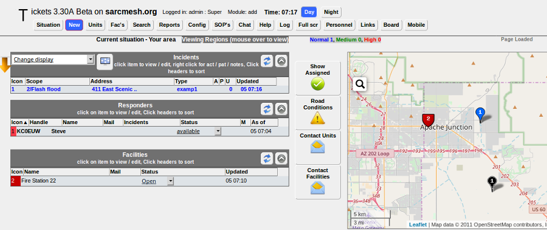

=======================
Computer Aided Dispatch
=======================

`Computer Aided Dispatch <https://en.wikipedia.org/wiki/Computer-aided_dispatch>`_ provides an automated way for emergency services agencies to keep track of incidents, activities, information, tasks, messages, and the status of deployed resources. Command staff are able to see the big picture, while at the same time maintaining detailed records of plans and actions for future reference. Deployed resources are able to clearly communicate in realtime, while having much better situational awareness of surrounding events.

Served agencies have been using Computer Aided Dispatch (CAD) software for quite some time, and it has become their preferred method for managing events and incidents within their jurisdiction. In emergencies when electrical power or mission-critical facilities become unavailable and agencies are forced to operate off-grid, AREDN |trade| operators with portable power for mesh networks and computing resources can bridge the gap by providing :abbr:`CAD (Computer Aided Dispatch)` solutions for personnel at key sites.

There is a wide variety of :abbr:`CAD (Computer Aided Dispatch)` software in use today. Many of the sophisticated commercial packages have integrated `automatic vehicle location (AVL) <https://en.wikipedia.org/wiki/Automatic_vehicle_location>`_ and `geographic information systems (GIS) <https://en.wikipedia.org/wiki/Geographic_information_system>`_ which require large amounts of network bandwidth and dedicated computing resources that might not be accessible during an emergency.

The programs described in this section can help you to provision :abbr:`CAD (Computer Aided Dispatch)` services for emergency use on your mesh network. The following list is not comprehensive or complete but represents a sample of the types of software that may be available for services on your network. Programs with open source licenses were included in this list, although software with proprietary licenses can also be deployed.

EmComMap
--------

EmComMap was designed by an `Amateur Radio Emergency Service <https://en.wikipedia.org/wiki/Amateur_Radio_Emergency_Service>`_ operator for use on AREDN |trade| mesh networks during deployments. It leverages modern technologies for interactive maps and sync-able web browser databases to enable map-based situational awareness and emergency communication across IP networks. Based on this architecture, EmComMap is one of the more mesh-friendly :abbr:`CAD (Computer Aided Dispatch)` programs with additional features in progress for data distribution.

A specific geographic region is defined within which an incident is in progress, and the location of resources are shown on the map using icons *(Police, Fire Department, Hospital, Government Facility, Incident Command Post, EmComMap Node)*. Each map can be zoomed and panned as required to view location details for all deployed resources. Incident information can be defined and updated on the *Incident* tab, while locations are defined and updated on the *Locations* tab. Message traffic is available to all operators across the network on the *Traffic* tab, and operators update their location and status on the *Operators* tab. Open Street Map tiles can be downloaded to the server for standalone operation.

All communications are tracked and can be exported in spreadsheet format for offline use. Message traffic can be filtered to view specific messages for selected locations, and the traffic table can also be sorted for viewing the details based on information in any column. Message severity levels and tactical call signs are supported, and operators are allowed to send messages and report status information on behalf of other users if necessary. EmComMap is a recent program under active development, with continual feature improvements in progress. For additional information about EmComMap, visit this link: `EmComMap <http://emcommap.org/>`_.

Open ISES Tickets
-----------------

The *Open Information Systems for Emergency Services* (ISES) project is a community of software developers, paramedics, EMTs, law enforcement, and fire fighters working to create software and training materials for the emergency service community. They currently offer the *Tickets* :abbr:`CAD (Computer Aided Dispatch)` system, which has an extensive suite of features that are accessible by web browser from a mesh network server. Any computing platform is capable of running a *Tickets* server if it supports the traditional `LAMP <https://en.wikipedia.org/wiki/LAMP_(software_bundle)>`_, `XAMPP <https://en.wikipedia.org/wiki/XAMPP>`_, or `MAMP <https://en.wikipedia.org/wiki/MAMP>`_ packages.

*Tickets* presents a situation dashboard showing incidents, responders, and facilities along with a GIS map of their locations. Open Street Map tiles can be downloaded for standalone operation. Clicking any of the controls allows operators to drill into item details, and *Tickets* provides database tracking for a large array of information about each item. The dashboard can be fully integrated with several different functions, including email, chat, routing, and tracking (for example, with `Automatic Packet Reporting System [APRS] <https://en.wikipedia.org/wiki/Automatic_Packet_Reporting_System>`_).

A variety of built-in reports are available which can be viewed, printed, and downloaded for distribution. Standard ICS forms are available for online completion and emailing, and custom *Standard Operating Procedure* (SOP) documents can be integrated for viewing through dashboard links in the web browser. For additional information about *Tickets*, visit this link: `Open ISES Tickets <https://sourceforge.net/projects/openises/>`_.

OpenCAD
-------

Like *ISES Tickets* described above, *OpenCAD* is a web server application which can run on any computing platform that supports a traditional LAMP stack. *OpenCAD*, however, is not map-based and does not provide GIS mapping features. It is aimed primarily at creating and tracking calls in a law enforcement context. Several user roles are defined, each with access to specific dashboard views tailored to their responsibilities. These roles include communications/dispatch, police, fire, EMS, sheriff, highway patrol, roadside assistance, and civilian. The main task of *OpenCAD* administrators is to approve new user access requests and to manage user settings across the system.

Users with law enforcement roles can view :abbr:`BOLOs (Be On the Look Out)` and active calls, as well as creating citations, warnings, and arrest reports. Users with fire and EMS roles can view and edit call details, as well as accepting call assignments. Dispatchers can create, edit, and assign calls, track resource availability, as well as viewing :abbr:`BOLOs (Be On the Look Out)`, citations, warnings, arrest reports, and warrants. Civilian and Roadside Assistance users can create calls. For additional information about *OpenCAD*, visit this link: `OpenCAD <https://opencad.io/>`_.

There is an older package similar to *OpenCAD*, but with fewer features, called *ampCAD*. Information is available here: `ampCAD <https://sourceforge.net/projects/ampcad/>`_

Example Computer Aided Dispatch Comparison
------------------------------------------

Platform abbreviations:
  win=MS Windows, mac=Apple, lin=Linux, rpi=Raspberry Pi

============  ==============  ===========  ===============  ======
Program       License         System Load  Platform         Effort
============  ==============  ===========  ===============  ======
EmComMap      open source     small        linux            medium
ISES Tickets  open source     small        win/lin/mac/rpi  medium
OpenCAD       open source     small        win/lin/mac/rpi  medium
============  ==============  ===========  ===============  ======

.. |trade|  unicode:: U+02122 .. TRADE MARK SIGN
   :ltrim:
