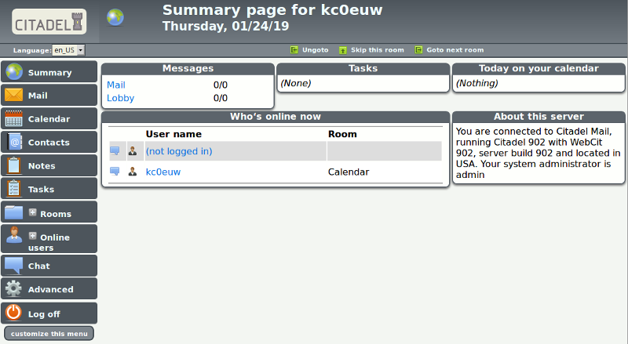
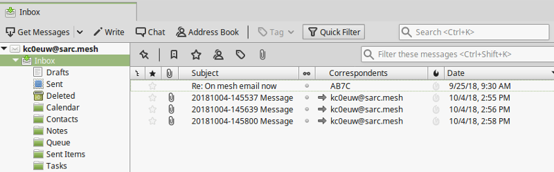
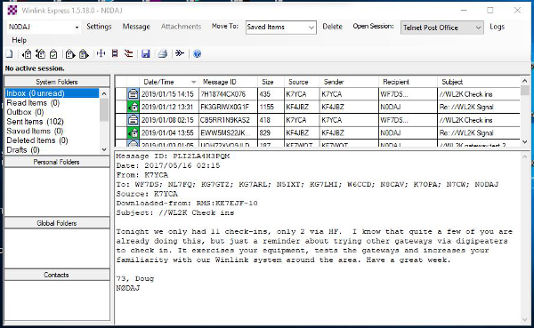
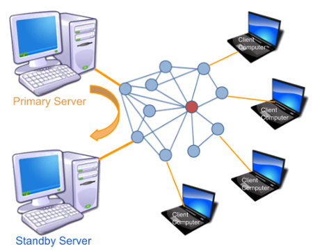

==============
Email Programs
==============

`Email <https://en.wikipedia.org/wiki/Email>`_ programs have become a communication standard for workers everywhere today. Email messages can include a wide range of information, from short chat-like interactions to lengthy and extensive text with complex document and image attachments. Whereas chat programs often assume that the sender and receiver are online at the same time, email programs use a `store and forward <https://en.wikipedia.org/wiki/Store_and_forward>`_ approach to ensure message delivery even when users are not connected simultaneously.

Email operates on a client-server model. Users create or read their messages on some type of client program, although this software could be hosted on a network web server and accessed through a user's web browser rather than requiring a standalone email program to be installed on the client computer. Client programs typically access messages from the email server using either `Internet Message Access Protocol (IMAP) <https://en.wikipedia.org/wiki/Internet_Message_Access_Protocol>`_ or `Post Office Protocol (POP) <https://en.wikipedia.org/wiki/Post_Office_Protocol>`_. Client programs use `Simple Mail Transfer Protocol (SMTP) <https://en.wikipedia.org/wiki/Simple_Mail_Transfer_Protocol>`_ to send messages to email servers, while the servers themselves use SMTP for both sending and receiving.

As with any client-server program, the email server must be reachable on a network segment with adequate bandwidth in order for the clients to exchange messages. If you have a choice, put your email server on one of your largest and most reliable network segments. Refer to this link for a comparison of email `Client Programs <https://en.wikipedia.org/wiki/Comparison_of_email_clients>`_, and visit this link for a comparison of email `Server Programs <https://en.wikipedia.org/wiki/Comparison_of_mail_servers>`_. The following list is not comprehensive or complete but represents a sample of the types of software that may be available for you to use as services on your mesh network. With one exception, only programs with open source licenses were included in this list, although proprietary email software can also be used.

Citadel/UX
----------

Not only does Citadel provide email, but it is also a full-featured *groupware* suite with chat rooms, calendars and scheduling, contact address book, file sharing, forum posting, and many other features. It contains built-in implementations of the following server protocols: IMAP, POP3, SMTP, XMPP, and ManageSieve. Citadel also provides user self-registration, which minimizes the administrative overhead of managing email addresses on the server.

Since a variety of features are bundled into a single application suite, Citadel is a less complicated and more integrated way to implement several network services at once by installing a single package capable of running on a lightweight `Raspberry Pi <https://en.wikipedia.org/wiki/Raspberry_Pi>`_ computer if necessary. Citadel's email services can be accessed using its browser-based webmail interface or from a separate email client program on a remote computer. For additional information about Citadel, visit this link: `Citadel <https://en.wikipedia.org/wiki/Citadel/UX>`_

Open Source Email Server
------------------------

In order to implement an open source email server you will need to install several individual software packages, each of which will process one or more of the required email protocols. This is slightly more complicated than implementing a single groupware package such as the *Citadel* program described in the previous section. Protocols and example packages are described in the following lists.

**SMTP**
  In order to implement an email server you will need to select a software package to handle the Simple Mail Transfer Protocol. You can select one of the example open source packages from the list below, or you can implement another SMTP agent of your choice.

  * `Sendmail <https://en.wikipedia.org/wiki/Sendmail>`_ is the original legacy SMTP server that is still used today, although one of the newer programs below is often chosen for its ease of configuration and added security features.
  * `Exim <https://en.wikipedia.org/wiki/Exim>`_ is the default SMTP server in Debian Linux, is well-documented, having many configurable features, and it runs from a single executable program.
  * `Postfix <https://en.wikipedia.org/wiki/Postfix_(software)>`_ is the default SMTP server in Ubuntu Linux and MacOS, with many integration and security features, and it runs a series of parallelized programs for improved performance.

**IMAP and POP3**
  In order for email clients to retrieve their messages you will need to select a software package to handle IMAP and POP3 communication. You can select the example open source package below or you can implement another IMAP/POP3 package of your choice.

  * `Dovecot <https://en.wikipedia.org/wiki/Dovecot_(software)>`_ is one of the most popular IMAP and POP3 servers for open source email systems, being found on more than 2/3 of the email servers across the Internet.

You will need to have detailed knowledge and skills when building your own open source email server, with the advantage of having complete control over everything on the system. There is some administrative overhead for creating and maintaining all user email accounts as well as handling other management tasks on your system. Using these open source software packages, it is possible to build a very robust email server that is capable of running on a small portable computer like a `Raspberry Pi <https://en.wikipedia.org/wiki/Raspberry_Pi>`_.

Using WinLink to Send Email
---------------------------

Although it is not typically used as a TCP/IP network application, many operators are already familiar with `WinLink 2000 <https://en.wikipedia.org/wiki/Winlink>`_ for sending message traffic between WinLink computers across amateur radio frequencies. It is possible to configure *RMS Express* and Telnet Post Office or Telnet P2P for sending email with attachments across a mesh network. You will need a stable Microsoft Windows computer with plenty of memory to run this system (8GB recommended). Refer to the information link below for details about the specific network port settings that will be required. The maximum attachment size is currently 5MB per message as compared to the 100KB limitation on HF and Packet RMS stations. For additional information, please visit the AREDN |trade| forum category on Winlink located here: `Winlink Forum <https://www.arednmesh.org/forums/winlink>`_

Keeping Multiple Servers in Sync
--------------------------------

Since the email *server* must be reachable on the network in order for *clients* to send and receive messages, and since a solitary email server can be a single point of failure, it may be useful to explore ways for redundant email servers to be kept in sync across the network. If one email server becomes unreachable, a backup or failover server could be used to keep the email service running.

For mission-critical services on high speed data networks, *Disaster Recovery* designs are often implemented to ensure that services continue operating in the event of a failure. There are several methods for accomplishing this, which usually involve duplicating server hardware and software with some type of data replication between these systems. At a high level, two basic designs could be implemented as described below.

**Manual Failover Design**
  In this design there is a primary server that remains active, with a duplicate backup server located on another network segment. The standby server is brought online only if the primary server becomes unreachable. Data that contains the configuration and message history on the primary server could be copied periodically to the standby server using an intelligent utility such as `rsync <https://en.wikipedia.org/wiki/Rsync>`_ running as a scheduled task which copies only what has changed since the last check. This design provides a fallback that can be used in case of emergency, but it requires some degree of manual intervention to bring up the standby service on the network when the primary becomes unreachable.

**Automated Failover Design**
  `High Availability <https://en.wikipedia.org/wiki/High-availability_cluster>`_ technology allows two or more sets of computing resources to send `heartbeat <https://en.wikipedia.org/wiki/Heartbeat_(computing)>`_ signals for detecting whether their services are available across the network. Several types of open source and commercial clustering packages are available, which provide varying degrees of complexity and recovery capabilities. Suffice it to say that many options are available for ensuring the availability of mission-critical services on your network. Feel free to research, investigate, and test several of these options if you have a pressing need for highly available mesh services.

As a general rule for mesh networks, simpler is better. The more complicated and automated you make your service design, the more network and computing resources will be required to operate the system. It is always best to conserve mesh networking resources wherever possible.

Example Email Service Comparison
--------------------------------

Platform abbreviations:
  win=MS Windows, mac=Apple, lin=Linux, rpi=Raspberry Pi

==========  ==================  ============  =================  ======
Program     Features            Network Load  Platform           Effort
==========  ==================  ============  =================  ======
Citadel     groupware, webmail  small         lin/mac/rpi        easy
Open Email  client-server       small         lin/mac/rpi        expert
WinLink     email, attachments  small         win (proprietary)  medium
==========  ==================  ============  =================  ======

.. |trade|  unicode:: U+02122 .. TRADE MARK SIGN
   :ltrim:
