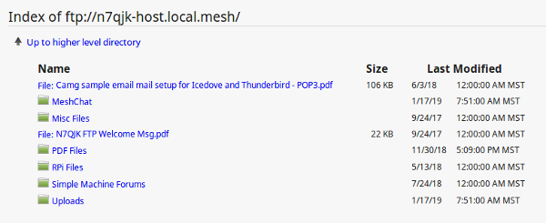
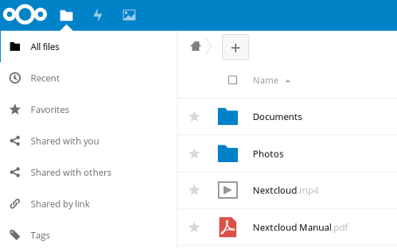
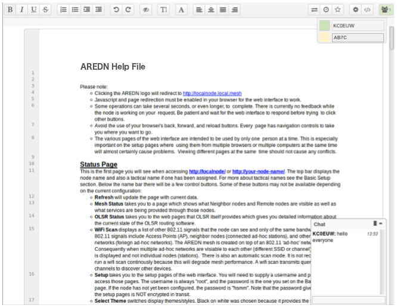

=====================
File Sharing Programs
=====================

`File sharing <https://en.wikipedia.org/wiki/File_sharing>`_ is a method of providing network users with access to digital content. One way to accomplish this is to *push* a copy of a file to users' computers, using either an email attachment or a file transfer program. Another approach is to create a central repository and allow users to *pull* files from this file share. Unless there is a special reason for pushing content, it is usually preferable to let users pull content as needed.

File transfer protocols themselves have minimal impact to network performance, but downloading a very large file across a mesh network could have a major performance impact. Transferring text files, and especially compressed text, should have minimal impact to the network, but a network could experience performance degradation while transferring files with lots of embedded formatting directives or images. High resolution audio files, image captures, or video recordings will also tax network resources when they are moving between nodes.

The following list is not comprehensive or complete but represents a sample of the types of programs that might be available to use for file sharing on your mesh network. Only programs with open source licenses were included in this list, although commercial software can also be used.

FTP Services
------------

`File Transfer Protocol (FTP) <https://en.wikipedia.org/wiki/File_Transfer_Protocol>`_ servers can be configured as file repositories from which users can copy digital content using FTP client programs. Some of the more common FTP server packages include `FileZilla Server <https://en.wikipedia.org/wiki/FileZilla#FileZilla_Server>`_, `ProFTPD <https://en.wikipedia.org/wiki/ProFTPD>`_, `Pure-FTPd <https://en.wikipedia.org/wiki/Pure-FTPd>`_, and `vsftpd <https://en.wikipedia.org/wiki/Vsftpd>`_ (which is the default FTP server in many Linux distributions).

All of the most common web browsers allow content to be downloaded using FTP as shown below, although they may not support all protocol extensions. However, there are many `FTP client programs <https://en.wikipedia.org/wiki/Comparison_of_FTP_client_software>`_ with complete FTP support. FTP is a tried-and-true method for retrieving files from a central repository.

Web Services
------------

File sharing can be accomplished by hosting downloadable files on a web server. These files can be downloaded from within web browsers using `Hypertext Transfer Protocol (HTTP) <https://en.wikipedia.org/wiki/Hypertext_Transfer_Protocol>`_ as well as other built-in file transfer protocols. Simply place files to be shared into the website directory structure and provide links to them on web pages.

There are also many web service packages that provide a robust file sharing interface similar to online cloud storage solutions. One example is `NextCloud <https://en.wikipedia.org/wiki/Nextcloud>`_, an open source file hosting suite with features similar to many of the Internet-based `cloud storage services <https://en.wikipedia.org/wiki/Comparison_of_file_hosting_services>`_.

Users login to NextCloud to see available content, and file sharing permissions can be set on a user or group basis. Files and folders can be uploaded, downloaded, moved, renamed, deleted, and previewed (depending on file type). Simple file version control is provided through auto-backup, and the *Details* sidebar lists past versions available for rollback. These and other similar software packages can provide a full-featured file sharing service when hosted on a web server.

Collaborative Computing
-----------------------

Collaborative computing enables people to collaborate on documents in real time. Multiple users dispersed across a wide geographic area can be working simultaneously to create or modify a set of documents that are available to others over the network. With this type of collaborative model, documents no longer need be viewed as static but can become truly living projects.

One example package that facilitates collaborative document creation is `Etherpad Lite <https://en.wikipedia.org/wiki/Etherpad>`_. Users access the Etherpad server through a web browser, so no client software is required on the users' computers. Anyone who connects to the service can create a new document or contribute to an existing document. Active users are displayed and have the ability to chat with each other in the messaging area. Changes to a document are periodically auto-saved, but users can force a checkpoint to capture the current state of a document. The "time slider" control allows users to view document revisions at any point in time throughout its history. Documents can also be downloaded in several formats (text, HTML, Open Document, Microsoft Word, or PDF).

`Collaborative document sharing <https://en.wikipedia.org/wiki/Document_collaboration>`_ could be very helpful for a number of EmComm use cases, such as maintaining an accurate picture of deployed resources at various locations during an incident or event. Document version tracking makes it possible to scroll back and forth in history to see the status of deployed resources at any given time, as well as to capture information and save it for wider distribution.

.. |trade|  unicode:: U+02122 .. TRADE MARK SIGN
   :ltrim:
