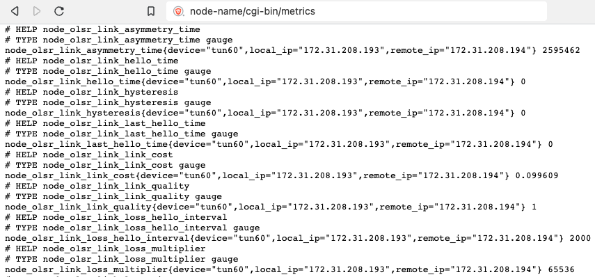
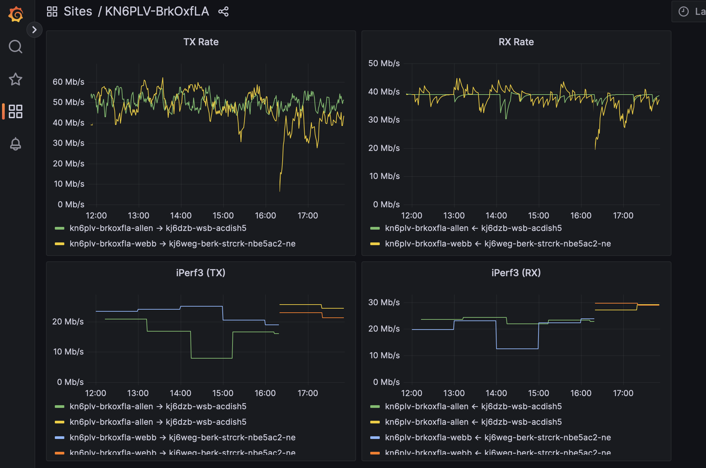
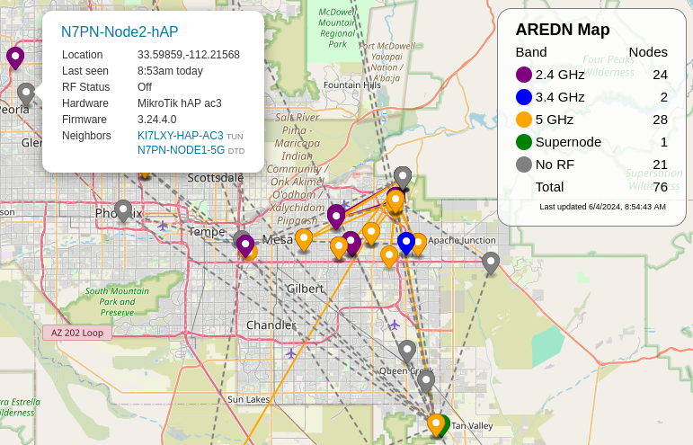

================
Networking Tools
================

There are several service programs that can assist in visualizing or mapping an AREDN® network, as well as for viewing local RF conditions near your node. Some of these programs are discussed below.

Manage Extra Static Routes
--------------------------

There may be cases when you need to create extra static routes to control the flow of network traffic through your node. You can maintain your extra routes by entering them into the ``/etc/aredn_include/static_routes`` file. You must login to your node at the command line and use the ``vi`` editor to manage the routes in this file. A helpful example is provided in the file, and you can view the `OpenWRT Static Routes <https://openwrt.org/docs/guide-user/network/routing/routes_configuration>`_ page for additional information about managing static routes.

AREDN® Prometheus Exporter
--------------------------

`Prometheus <https://en.wikipedia.org/wiki/Prometheus_(software)>`_ is an open-source monitoring and alerting toolkit which collects and stores metrics as time series data. Prometheus evaluates rule expressions, displays the results, and can trigger alerts when specified conditions are detected. It can collect metrics from AREDN® nodes running a recent firmware version.

Examples of AREDN® metrics include:

- Node details (name, model, firmware, description, Lat/Lon, grid square, band, channel, width, frequency, SSID)
- Memory, storage, CPU, and networking metrics
- RF metrics (signal, noise, MSC rate, TX/RX packets/rates)
- LQM metrics
- OLSR link info

In order for Prometheus to pull metrics from a node it will use the following target URL: ``http://<NODE>.local.mesh/cgi-bin/metrics``, and metrics are returned by the node as standard *text/plain* content. Minimal node resources are required to support Prometheus data collection since the node runs no metrics service and uses minimal resources when its URL is queried.

|

The AREDN® node simply makes these metrics available for Prometheus to pull. For additional information about Prometheus itself, visit `their website here <https://prometheus.io/>`_. The following image shows Prometheus metrics for an AREDN® node being displayed by the `Grafana <https://en.wikipedia.org/wiki/Grafana>`_ visualization application.

|

KN6PLV Mesh Map
---------------

`Tim KN6PLV <https://www.qrz.com/db/KN6PLV>`_ created these programs to discover and visualize your mesh network. They can be installed on one of your LAN-attached computers that is running a web server. This software is available for download here: `KN6PLV NewMeshMap <https://github.com/kn6plv/NewMeshMap>`_. Once you have followed the install instructions and have a working mapper, you will be able to view your mesh network in a web browser (as shown in the example below).

|
