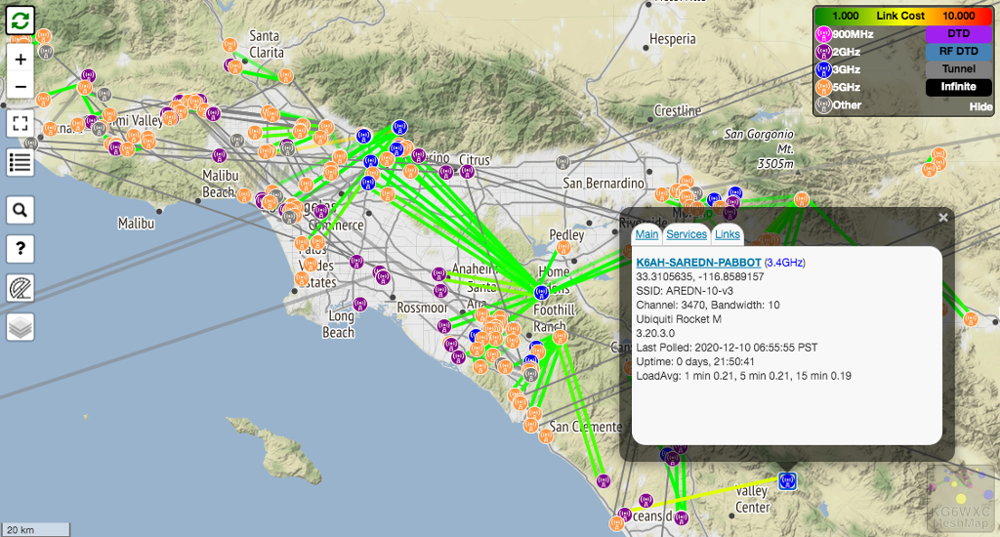
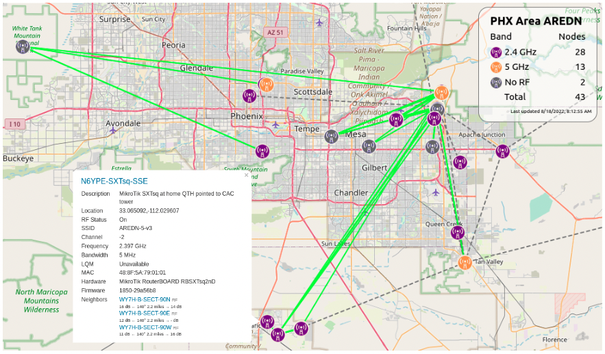
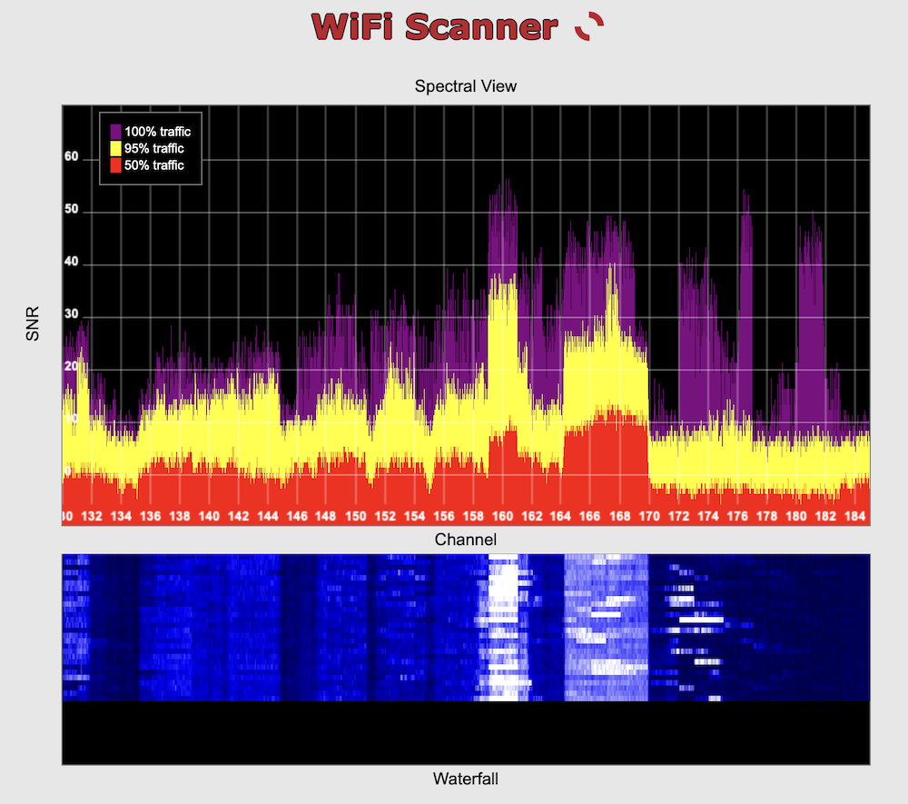

=======================
Network Discovery Tools
=======================

There are several service programs that can assist in visualizing or mapping an AREDN |trade| network, as well as for viewing local RF conditions near your node. Some of these programs are discussed below.

KG6WXC MeshMap Network Visualizer
---------------------------------

`Eric KG6WXC <https://www.qrz.com/db/KG6WXC>`_ created this useful tool and makes it available as an open source project. MeshMap can be installed on any mesh services computer having `LAMP <https://en.wikipedia.org/wiki/LAMP_(software_bundle)>`_ software, which allows it to run on a Raspberry Pi in your shack or in the field. MeshMap runs continuously and discovers/polls live nodes to display their current configuration, services, and network link information. It maintains a persistent database of all nodes that have been discovered.

For additional information visit this link: `KG6WXC MeshMap <https://gitlab.kg6wxc.net/mesh/meshmap>`_.

|

KP4MSR MeshMap Network Visualizer
---------------------------------

`Manual KP4MSR <https://www.qrz.com/db/KP4MSR>`_ originally created this software for the Puerto Rico AREDN |trade| network, with a current fork and rewrite of the code maintained by `Tim KN6PLV <https://www.qrz.com/db/KN6PLV>`_. This program does *not* run continuously and does *not* maintain a persistent database of nodes, so it is less resource-intensive on the network. Once the static pages are built, it can be run on any device with a web server, including on a node with enough free memory.

For additional information visit this link: `KN6PLV MeshMap <https://github.com/kn6plv/MeshMap>`_.

|

KN6PLV Network Waterfall Scanner
--------------------------------

`Tim KN6PLV <https://www.qrz.com/db/KN6PLV>`_ created this program to assist with discovering the RF conditions around your node. It is installed as a node package which is available here: `KN6PLV Waterfall <https://github.com/kn6plv/waterfall>`_. Once installed it is accessible via URL from any web browser on the network (``http://[NODENAME]/cgi-bin/waterfall``). It will disconnect your node from the mesh while it continuously scans for nearby RF signals, so it does require authentication with the node's login credentials in order to run. The *Spectral View* shows the strength of nearby signals, while the *Waterfall* maintains a record over time of the RF environment.

|
