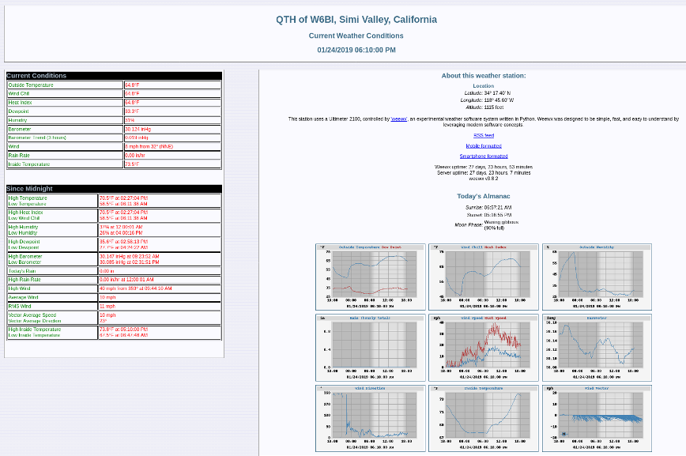
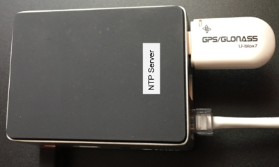
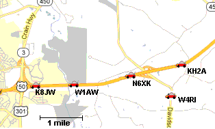
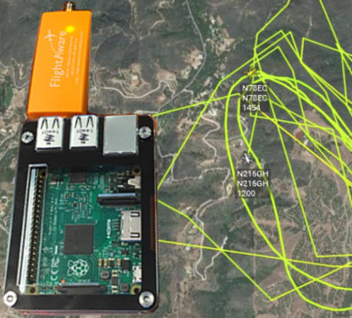

=======================
Other Possible Services
=======================

As mentioned in the *Services Overview*, almost any program that can operate across a peer-to-peer TCP/IP network is a candidate for AREDN |trade| networking. Many useful services have been discussed previously, and this section will list some of the other types of services that you might consider deploying on your mesh network.

MeshMap Network Visualizer
--------------------------

**MeshMap** provides an automated way to visualize your AREDN |trade| network topology. `Eric KG6WXC <https://www.qrz.com/lookup/kg6wxc>`_ created this useful tool and makes it available as an open source project. MeshMap can be installed on a mesh services computer having minimal hardware specifications, which allows it to run on a Raspberry Pi in your shack or in the field. MeshMap automatically discovers live nodes and periodically polls them to display their current configuration, services, and network link information.
For additional information about MeshMap, visit this link: `meshmap <https://gitlab.kg6wxc.net/mesh/meshmap>`_.

.. image:: _images/meshmap.png
   :alt: MeshMap Display
   :align: center

weeWx Weather Service
---------------------

Many operators have weather stations, as do quite a few repeater sites. If
those weather stations can be put on the mesh network, they can provide
a valuable overview of weather conditions across a wide area, for example, showing wind speeds and rainfall totals for each location. The *weeWx* package is available for many different operating systems and weather station models. It supports serial, USB, and Ethernet connections to weather stations. For additional information about weeWx, visit this link: `weeWx <http://www.weewx.com>`_.

Network Time Services
---------------------

Although the AREDN |trade| nodes themselves do not depend on network time synchronization, there may be other programs or services running on your mesh network which would benefit from having accurate network time updates. `Network Time Protocol (NTP) <https://en.wikipedia.org/wiki/Network_Time_Protocol>`_ is a reliable way for networked devices to update their system clocks. This may be especially helpful for devices that do not have an onboard realtime clock, such as Raspberry Pi computers. It may also be important to have accurate timestamps across the network for programs such as email message logging, file updates, video surveillance images, and many others.

Most NTP implementations depend on an Internet connection in order to synchronize with upstream time servers. However, it would be more useful to be able to synchronize system clocks in an off-grid situation when AREDN |trade| nodes are deployed during an emergency. One way to accomplish this would be to configure one or more battery powered computers as NTP servers which retrieve upstream time from GPS satellites *(stratum 0)*. Position your portable NTP server so that it maintains a clear view of the sky and can get a fix on as many GPS satellites as possible.

In order for NTP to operate properly, each client device must have a fast and reliable connection to the NTP servers on the network. Be sure to locate your NTP servers on reliable high-speed segments of your mesh. For additional information about building an off-grid NTP server, visit this link: `G4WNC NTP post <https://photobyte.org/raspberry-pi-stretch-gps-dongle-as-a-time-source-with-chrony-timedatectl/#>`_.

GPS Tracking Services
---------------------

Tracking deployed resources is an important task during any emergency. There are many options for monitoring and displaying the GPS locations of tracked resources, two of which are mentioned here.

Many amateur radios and portable locating beacons transmit `Automatic Packet Reporting System (APRS) <https://en.wikipedia.org/wiki/Automatic_Packet_Reporting_System>`_ information. It is possible to implement an APRS receiver using inexpensive, battery-powered, portable computers and USB `Software Defined Radios (SDR) <https://en.wikipedia.org/wiki/Software-defined_radio>`_. The details are widely available for building these receivers using Raspberry Pi computers with `Direwolf <https://github.com/wb2osz/direwolf/blob/master/README.md>`_ and `Xastir <http://xastir.org/index.php/Main_Page>`_ or `YAAC <https://sourceforge.net/p/yetanotheraprsc/wiki/Home/>`_ software.

There may be situations when it would also be helpful to track the locations of aircraft during an emergency. `Automatic Dependent Surveillance-Broadcast (ADS-B) <https://en.wikipedia.org/wiki/Automatic_dependent_surveillance_%E2%80%93_broadcast>`_ information is available which can be captured using portable computers with ADS-B receivers. The following image shows the track of two water tankers dropping fire retardant above Santa Barbara, California, during the 2017 `Thomas Fire <https://en.wikipedia.org/wiki/Thomas_Fire>`_. This information was displayed across an AREDN |trade| network using an `ADS-B Ground station <https://flightaware.com/adsb/piaware/build>`_ which was running as a mesh network service.

----------

Depending on the requirements of your specific situation, almost any program that can operate across a peer-to-peer TCP/IP network could be deployed as a service on your mesh network. Check the `AREDN Forums <https://www.arednmesh.org/forum>`_ for additional information, ideas, and how-to posts about possible services for mesh networking.

.. |trade|  unicode:: U+00AE .. Registered Trademark SIGN
   :ltrim:
