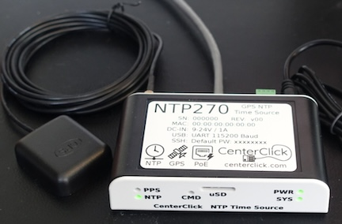

==============
Other Services
==============

As mentioned in the *Services Overview*, almost any program that can operate across a peer-to-peer TCP/IP network is a candidate for AREDN® networking. Many useful services have been discussed previously, and this section will list some of the other types of services that you might consider deploying on your mesh network.

Network Time Services
---------------------

There are programs or services running on your node and network which would benefit from having accurate network time updates. `Network Time Protocol (NTP) <https://en.wikipedia.org/wiki/Network_Time_Protocol>`_ is a reliable way for networked devices to update their system clocks. It may be important to have accurate timestamps across the network for services such as Wireguard, MeshChat, email message logging, file timestamps, video surveillance images, and many others.

.. image:: _images/ntp-gps.png
   :alt: OffGrid NTP Server
   :align: right

Most NTP implementations depend on an Internet connection in order to synchronize with upstream time servers. To synchronize system clocks in an off-grid situation, one or more battery powered devices can be configured as NTP servers which retrieve upstream time from GPS satellites *(stratum 0)*.

Position your portable NTP server so that it maintains a clear view of the sky and gets a fix on as many GPS satellites as possible. In order for NTP to operate properly, each client device must have a reliable connection to the NTP servers on the network. Be sure to locate your NTP servers on reliable high-speed segments of your mesh.

You may choose to purchase an off-the-shelf NTP appliance such as those offered by `Centerclick <https://centerclick.com/ntp/>`_ and others. There are also many sources of information for building your own off-grid NTP server (for example, this one using a Raspberry Pi: `G4WNC NTP <https://photobyte.org/raspberry-pi-stretch-gps-dongle-as-a-time-source-with-chrony-timedatectl/#>`_)

weeWx Weather Service
---------------------

Many operators have weather stations, as do quite a few repeater sites. If
those weather stations can be put on the mesh network, they can provide
a valuable overview of weather conditions across a wide area, for example, showing wind speeds and rainfall totals for each location. The *weeWx* package is available for many different operating systems and weather station models. It supports serial, USB, and Ethernet connections to weather stations. For additional information about weeWx, visit this link: `weeWx <http://www.weewx.com>`_.

.. image:: _images/weewx.png
   :alt: weeWx Display
   :align: center

GPS Tracking Services
---------------------

Tracking deployed resources is an important task during any emergency. There are many options for monitoring and displaying the GPS locations of tracked resources, two of which are mentioned here.

.. image:: _images/aprs.png
   :alt: APRS Map Display
   :align: right

Many amateur radios and portable locating beacons transmit `Automatic Packet Reporting System (APRS) <https://en.wikipedia.org/wiki/Automatic_Packet_Reporting_System>`_ information. It is possible to implement an APRS receiver using inexpensive, battery-powered, portable computers and USB `Software Defined Radios (SDR) <https://en.wikipedia.org/wiki/Software-defined_radio>`_. The details are widely available for building these receivers using Raspberry Pi computers with `Direwolf <https://github.com/wb2osz/direwolf/blob/master/README.md>`_ and `Xastir <https://sourceforge.net/projects/xastir/>`_ or `YAAC <https://sourceforge.net/p/yetanotheraprsc/wiki/Home/>`_ software.

There may be situations when it would also be helpful to track the locations of aircraft during an emergency. `Automatic Dependent Surveillance-Broadcast (ADS-B) <https://en.wikipedia.org/wiki/Automatic_dependent_surveillance_%E2%80%93_broadcast>`_ information is available which can be captured using portable computers with ADS-B receivers. The following image shows the track of two water tankers dropping fire retardant above Santa Barbara, California, during the 2017 `Thomas Fire <https://en.wikipedia.org/wiki/Thomas_Fire>`_. This information was displayed across an AREDN® network using an `ADS-B Ground station <https://flightaware.com/adsb/piaware/build>`_ which was running as a mesh network service.

.. image:: _images/ADS-B.png
   :alt: ADS-B Map Display
   :align: center

|

Depending on the requirements of your specific situation, almost any program that can operate across a peer-to-peer TCP/IP network could be deployed as a service on your mesh network.
