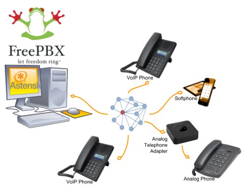

=============================
VoIP Audio/Video Conferencing
=============================

The programs described in the previous sections can facilitate the sharing of detailed information across your mesh network. Some of them attempt to emulate a conversation, but nothing can replace an actual interactive discussion. Today people are accustomed to voice conversations, and since much of a message is communicated by non-verbal queues, having an audio-visual conversation can be even more effective. However, these communication advantages come at a cost. Multimedia programs will typically have a much greater impact on network performance than the programs mentioned previously.

The software described in this section can help you to provision services that enable both voice and video conferencing on your *meshnet*. The phrase `Voice over IP (VoIP) <https://en.wikipedia.org/wiki/Voice_over_IP>`_ encompasses a collection of technologies capable of encoding and delivering realtime multimedia content across a digital network. When you have an established need for this type of communication, and if your mesh network is capable of supporting it, there are many reliable options for implementing VoIP and video conferencing.

The following list is not comprehensive or complete but represents a sample of the types of software that may be available for services on your mesh network. With one exception, programs having open source licenses were included in this list, although software with proprietary licenses can also be used. Dozens of VoIP programs have been available over the years, but the list of current open source projects in active development has dwindled over the past decade. Refer to this link for a comparison of `VoIP client and server software <https://en.wikipedia.org/wiki/Comparison_of_VoIP_software>`_.

VoIP Server
-----------

**Asterisk Server**
  `Asterisk <https://en.wikipedia.org/wiki/Asterisk_(PBX)>`_ is one of the original *software* `Private Branch eXchange (PBX) <https://en.wikipedia.org/wiki/IP_PBX>`_ servers. It was first designed to run on Linux computers, but it is now available for MacOS and OpenWRT routers. It has been used to build large-scale telephony systems so it has many of the features of commercial and proprietary PBX systems, including voice mail, conference calling, interactive voice response (IVR) menus, and automatic call distribution.

  Dozens of full-length books have been written about Asterisk, so it is widely documented. It also serves as the underlying communication engine for several other software PBX packages. Asterisk is extremely robust tried-and-true IP-PBX software, but you will need specific knowledge and skills to implement it.

**FreePBX Server**
  `FreePBX <https://en.wikipedia.org/wiki/FreePBX>`_ is a web-based graphical user interface (GUI) for managing Asterisk. However, it is most commonly deployed as part of the integrated `FreePBX Distro <https://en.wikipedia.org/wiki/FreePBX_Distro>`_, which installs a complete Linux operating system with Asterisk, FreePBX, and software dependencies included.

  All of the extensive features of Asterisk are available along with the benefit of having the FreePBX web interface to facilitate Asterisk management, making it much easier for users who are not telephony experts. Many mesh network operators who deploy VoIP have taken advantage of the *FreePBX Distro* when implementing their PBX services.

VoIP Endpoints
--------------

Once you have a VoIP PBX provisioned on your mesh network, you will need VoIP endpoints which can communicate through the server. Specialized `VoIP phone <https://en.wikipedia.org/wiki/VoIP_phone>`_ hardware is available from several manufacturers which can provide communication endpoints on your network. It is also possible to use legacy analog phone hardware connected to the network using `Analog Telephone Adapters (ATA) <https://en.wikipedia.org/wiki/Analog_telephone_adapter>`_. In addition to these options, there are pure software phones (`softphones <https://en.wikipedia.org/wiki/Softphone>`_) that are supported on a variety of devices, such as the Linphone program described below.

**Linphone Softphone**
  `Linphone <https://en.wikipedia.org/wiki/Linphone>`_ is a software phone that is supported on Windows, Linux, MacOS, Raspberry Pi, iPhone, and Android. It can be used to place voice and video direct calls as well as calls through a VoIP PBX like those mentioned above. Users can transfer calls to other numbers, send chat messages, share pictures or files, and merge calls into a group conference. The softphone has the ability to manage contact lists, and call history is available for future reference.

**Mumble**
  `Mumble <https://en.wikipedia.org/wiki/Mumble_(software)>`_ is a VoIP package that is available on Linux, MacOS, and Windows systems which support the `Qt <https://en.wikipedia.org/wiki/Qt_(software)>`_ platform. Mobile apps are also available, such as *Mumblefy* for iPhone and *Plumble* for Android.

  Hosting Mumble locally requires downloading the *Murmur* server, which is included as an option in the Mumble installer. The primary users of Mumble are Internet video gamers who want to communicate with each other during game play. However, it can also be used as a non-gaming voice communication service which does not require that an IP-PBX server exist on the network.

Video Conferencing Software
---------------------------

**FreeSWITCH Server**
  `FreeSWITCH <https://en.wikipedia.org/wiki/FreeSWITCH>`_ is a recent communication platform that can be used to build voice PBX systems with voice response menus, video conferencing with chat messaging and screen sharing capabilities, and full `WebRTC <https://en.wikipedia.org/wiki/WebRTC>`_ support. Its modular design makes it possible to install only what is required to meet your communication needs. Currently the FreeSWITCH package can be installed on Linux and Windows servers, and it can be compiled on MacOS computers if required.

  FreeSWITCH provides robust voice and video communication, voicemail, interactive voice response (IVR) menus, user directories, call accounting, screen sharing, chat messaging, call recording, hold music, and many other features that can be implemented as required. It is an extremely flexible communication platform, but you will need specific knowledge and skills in order to install, configure, and manage it as a service.

**TeamTalk**
  `TeamTalk <https://en.wikipedia.org/wiki/TeamTalk>`_ is an audio-visual conferencing system which enables people to communicate and share information across the network. It is often classified as *freeware*, but the TeamTalk server is proprietary and its source code is not publicly available. During a conference users talk through their computer microphone, see others via their webcams, create instant messages, share files, and show desktop applications. The TeamTalk software package bundles the client and server programs, so any computer may play the role of client or server.

  Voice and video conversations happen in channels or rooms, and a single server can host multiple rooms. While participating in a channel, users can write text messages in the *Chat* tab, view `AV <https://en.wikipedia.org/wiki/Audiovisual>`_ webcam streams in the *Video* tab, see shared applications in the *Desktops* tab, and download files from the *Files* tab. The server owner can specify a wide range of access permissions for each available room. TeamTalk is currently supported on Windows, Linux, MacOS, and Raspberry Pi computers.

Example VoIP Service Comparison
-------------------------------

Platform abbreviations:
  win=MS Windows, mac=Apple, lin=Linux, rpi=Raspberry Pi

==========  ==================  ============  ==================  ======
Program     Features            Network Load  Platform            Effort
==========  ==================  ============  ==================  ======
Asterisk    extensive           medium        lin/mac/rpi         expert
FreePBX     web management      medium        lin/mac/rpi         medium
Linphone    client softphone    small         win/lin/mac/mobile  easy
Mumble      voice + chat        medium        win/lin/mac         medium
FreeSWITCH  PBX + video         medium-large  win/lin/mac/rpi     expert
TeamTalk    video conferencing  large         win/lin/mac/rpi     easy
==========  ==================  ============  ==================  ======

.. |trade|  unicode:: U+02122 .. TRADE MARK SIGN
   :ltrim:
