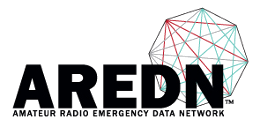

===========================
AREDN |trade| Documentation
===========================

:Release: |release|

This documentation set consists of several sections which are shown in the navigation list.

* The **Getting Started Guide** walks through the process of configuring an AREDN |trade| radio node to be part of a mesh network.
* The **Network Design Guide** provides background information and tips for planning and deploying a robust mesh network.
* The **Applications and Services Guide** discusses the types of programs or services that can be used across a mesh network.
* The **How-to Guides** provide tips and techniques for various tasks.
* Finally, the **Appendix** contains supplementary information.

If you wish to locate specific topics within the documentation, you can type keywords into the *Search docs* field to display a list of items which match your search.

If you would like to see the documentation for a specific AREDN |trade| release, click on the **Read the Docs** label at the bottom of the navigation bar. This label shows the version you are currently viewing, but clicking the label bar opens a panel with several other options. Here you may choose to view another version of the documentation, and you can also download the entire documentation set in any of several formats *(PDF, ePub, HTML)* for offline use.

.. note:: AREDN |trade| is a registered trademark of *Amateur Radio Emergency Data Network, Inc.* and may not be used without permission.

.. toctree::
   :maxdepth: 1
   :caption: Getting Started Guide
   :hidden:

   arednGettingStarted/aredn_overview
   arednGettingStarted/selecting_devices
   arednGettingStarted/downloading_firmware
   arednGettingStarted/installing_firmware
   arednGettingStarted/basic_setup
   arednGettingStarted/node_status
   arednGettingStarted/mesh_status
   arednGettingStarted/advanced_config
   arednGettingStarted/report_issues

.. toctree::
   :maxdepth: 1
   :caption: Network Design Guide
   :hidden:

   arednNetworkDesign/networking_overview
   arednNetworkDesign/network_topology
   arednNetworkDesign/frequency_bands
   arednNetworkDesign/channel_planning
   arednNetworkDesign/network_modeling

.. toctree::
   :maxdepth: 1
   :caption: Applications and Services Guide
   :hidden:

   arednServicesGuide/services_overview
   arednServicesGuide/chat_programs
   arednServicesGuide/email_programs
   arednServicesGuide/file_sharing
   arednServicesGuide/voip_programs
   arednServicesGuide/video_streaming
   arednServicesGuide/dispatch_programs
   arednServicesGuide/other_programs

.. toctree::
   :maxdepth: 1
   :caption: How-to Guides
   :hidden:

   arednHow-toGuides/firmware_tips
   arednHow-toGuides/home-router-connection
   arednHow-toGuides/siso-mimo
   arednHow-toGuides/radio_mobile_settings
   arednHow-toGuides/dish-aiming
   arednHow-toGuides/iperf
   arednHow-toGuides/max_tunnel_settings
   arednHow-toGuides/lqm
   arednHow-toGuides/puttygen_ssh_keys
   arednHow-toGuides/local-package-repo
   arednHow-toGuides/devtools

.. toctree::
   :maxdepth: 1
   :caption: Appendix
   :hidden:

   appendix/freq_charts
   appendix/more_info
   LICENSE
