==================
Why AREDN |trade|?
==================

AREDN |trade| provides a way for amateur radio operators to create high-speed data networks for use in emergency and community service communication. At a high level, an Amateur Radio Emergency Data Network is simply another tool for your EmComm toolbox. As an amateur radio operator involved in emergency communication, you already have quite a few RF resources that you use on a regular basis. AREDN |trade| is yet another tool that you might want to have available if it meets an important EmComm requirement, which we’ll see in a moment.

Some seasoned operators may ask, “Why do I need another tool when the ones I already have are working just fine?” The simple answer is that you only need AREDN |trade| when it serves a useful purpose or meets an important need for your served agency. As always, you should use the right tool for the job.

When might you want to use AREDN |trade| mesh networking? It depends on what type of communication is required for your deployment. AREDN |trade| is very useful if your served agency needs specific applications or services that require a computer network between sites. If high-speed digital communication is needed across an area, then AREDN |trade| is a good solution. If the sites to be linked are located in areas where normal infrastructure has become unavailable, then AREDN |trade| nodes can be used to create a portable off-grid data network. Also, if different resources are transient because they come and go at various locations, then an AREDN |trade| node’s ability to automatically join or form mesh networks might be a real benefit. It might be helpful to look at the evolution of EmComm capabilities used by amateur radio operators through the years.

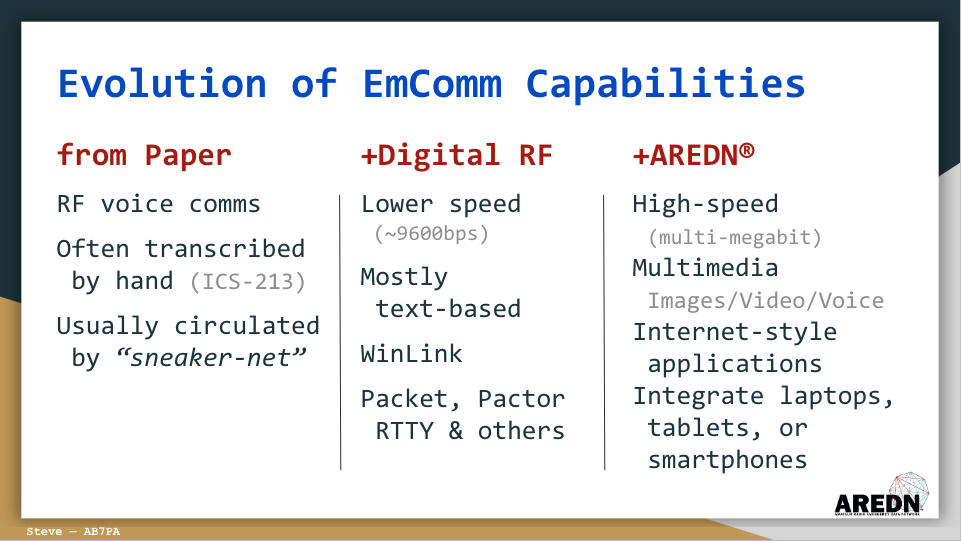

|

Traditionally we have used RF voice communication on a variety of radio bands. A typical message-passing scenario involved giving the message to a radio operator who would write or type it onto a standard ICS-213 form. The message would then be relayed by RF voice comms to another operator who would write or type it on another ICS-213 form at the receiving end. The form would typically be hand-delivered to the recipient who would read and acknowledge the message. Any reply would then be handled through the same process from the receiving end back to the originator. This tried-and-true method has worked well, and it continues to work for handling much emergency and event traffic.

In recent years Digital RF communication was included in the EmComm toolkit, with the addition of things like Packet Radio and WinLink. These modes moved emergency message passing into the digital realm, and this minimized or eliminated some of the sources of error in the communication chain. Digital RF communication was mainly text-based and is relatively slow speed but very reliable.

When AREDN |trade| became available it added several features which the served agency staff were already familiar with in their normal operations. These include the ability to transfer digital messages at relatively high speeds (in the multi-megabit range), as well as the capability for multimedia communication such as Voice, Photos, and streaming Video. It gave them the ability to use Internet-style applications or programs, and to integrate their smartphones, tablets, and laptops into the EmComm network. Let’s take a look at one example of how amateur public service communication has evolved over the years.

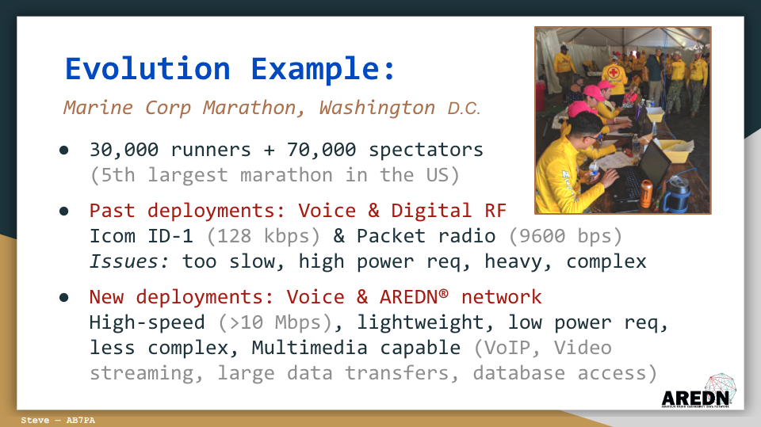

|

This photo was taken at a recent Marine Corp Marathon in the Washington, DC area. It’s one of the largest marathons in the country, with around 100,000 participants and spectators. A group of amateur radio operators has been providing communication services for this event for many years.

In the past they used mainly Voice & Digital RF modes. Typically they deployed Icom ID-1 data radios with speeds around 128 kbps, as well as packet radio with speeds around 9600 baud. Their After Action Reports identified several concerns, though. They indicated that data transfer rates were too slow. They also mentioned that the equipment was heavier and more complex to set up, as well as requiring higher capacity portable power sources.

For a couple of years they began experimenting with AREDN |trade|, and recent deployments have been based around AREDN |trade| networks. They indicated that they were able to achieve high data transfer speeds (in the range of 10 Mbps or more), using equipment that was lighter weight, less complex, and required much less power to operate. In addition, they were able to provide Voice over IP, Video Streaming, and multi-user network database access.

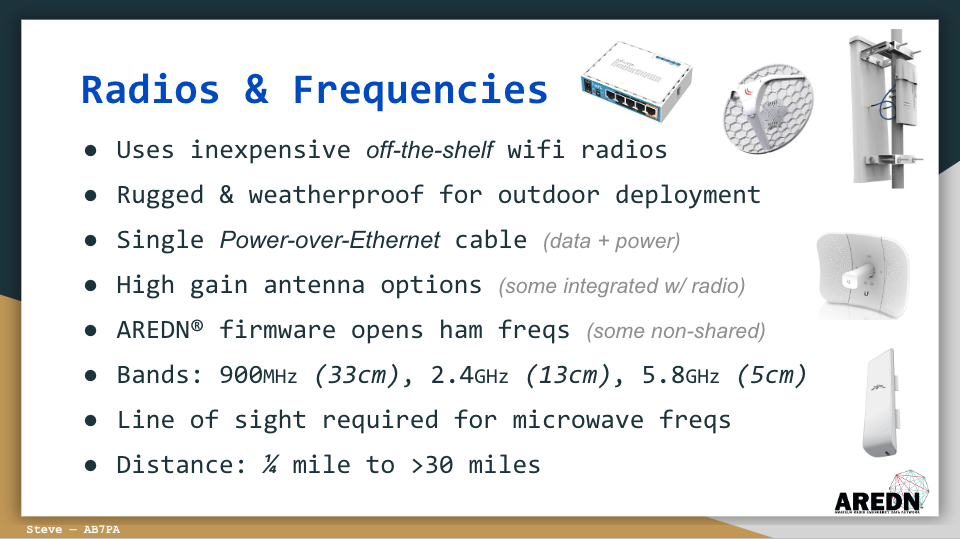

|

Devices that support AREDN |trade| come in a wide variety of shapes and sizes because AREDN |trade| firmware can be installed on many types of inexpensive “off the shelf” wifi radios. AREDN |trade| allows us to repurpose commercially available radios as mesh network nodes, many of which can communicate on unshared frequencies set aside specifically for licensed amateurs. Most of these commercial radios are rugged and weather-proof for outdoor installations. They typically use Power over Ethernet (PoE) which makes them less complicated to deploy by having a single cable to the device. Many of them also have integrated high gain antennas.

The frequency ranges that are currently supported are the 900 MHz, 2.4 GHz, and 5.8 GHz bands. These microwave frequencies do require direct line of sight for reliable communication. Depending on the type of radios and antennas that are deployed, it’s possible to achieve network links anywhere from a few miles to well over 30 miles between sites.

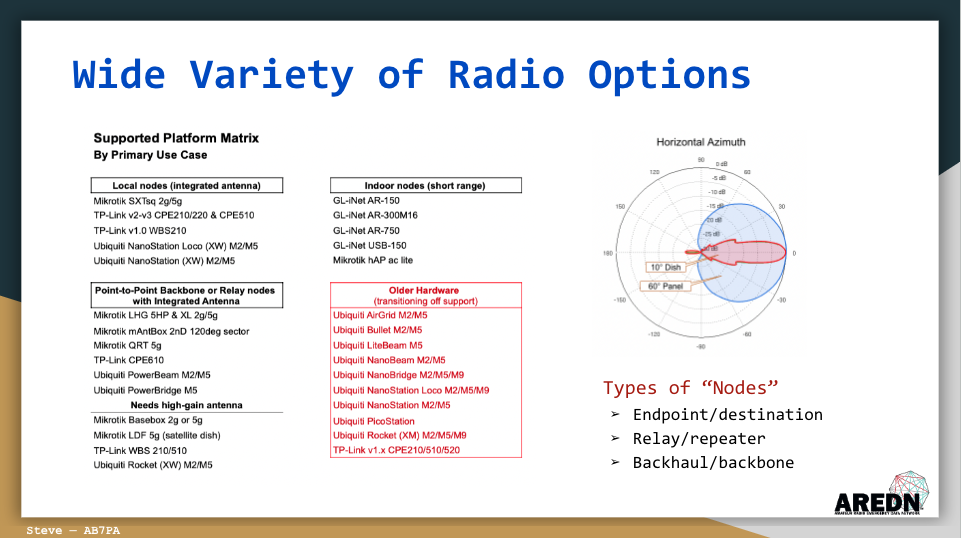

|

There are many radio options for different use cases. Some nodes are small indoor-only devices that provide both Ethernet and standard WiFi coverage, as well as mesh RF coverage out to a limited distance. Other radios are intended to provide mesh RF coverage to a 90 or 120 degree sector for devices at longer distances. Still other radios are designed for narrow beam, high speed, point to point data transfer, typically between mountaintop or backbone locations.

From this you can see that different types of radios serve different functions within the wider mesh network. You could categorize them as local endpoint nodes, or intermediate relay nodes, or high-speed backhaul nodes based on the purpose they serve for the network as a whole.

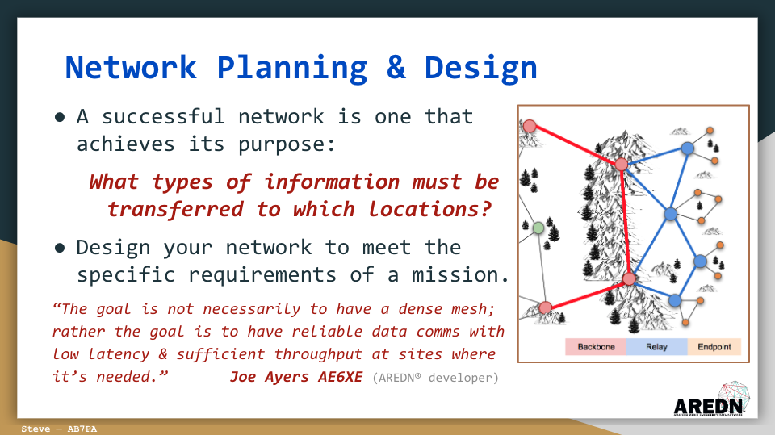

|

For our purposes in providing emergency or event communication as volunteers, we should focus on designing a network that is able to reliably transfer information to and from the locations where it is needed. A successful network is one that achieves its purpose, so design your networks to meet the specific requirements of a mission. We’ll see some good examples of this in a moment, but we should keep this as our main goal for using AREDN |trade| to provide EmComms.

In simplest terms, when you deploy AREDN |trade| devices you are providing a high-speed digital data network. Keep in mind that the network itself doesn’t really accomplish your mission. The applications, programs, and services riding your network are the key to accomplishing the mission. Your group may or may not be responsible for providing those applications and services. But if you do provide a program or service, be sure that what you provide is simple and intuitive to use, both for other amateur operators as well as for served agency staff members. Let’s look at some specific examples.

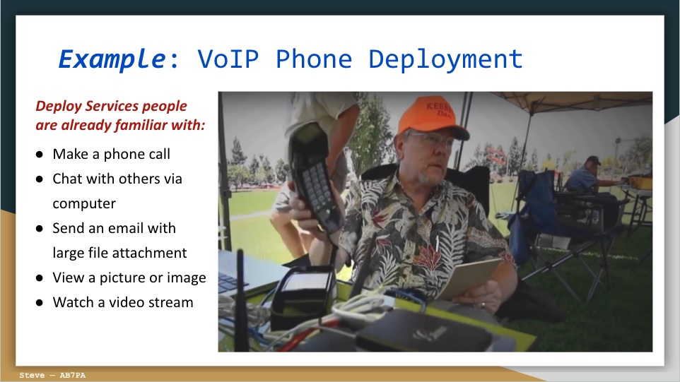

|

Whenever possible, deploy services that people are already familiar with. These days anyone can pick up a telephone and call someone’s phone number. They’re used to chatting with friends and co-workers using their computer keyboard. Almost everyone can read and send an email, often with large files or photos as attachments. People are used to pulling up a photo or image in their web browser or watching a streaming video from a web site. These are the types of services that would be a good fit for AREDN |trade| networks.
In this example, several stations were set up as part of an EmComms exercise. Participants were able to pick up a standard telephone to dial or answer phone calls between distant locations, all transmitted by RF using an AREDN |trade| network.

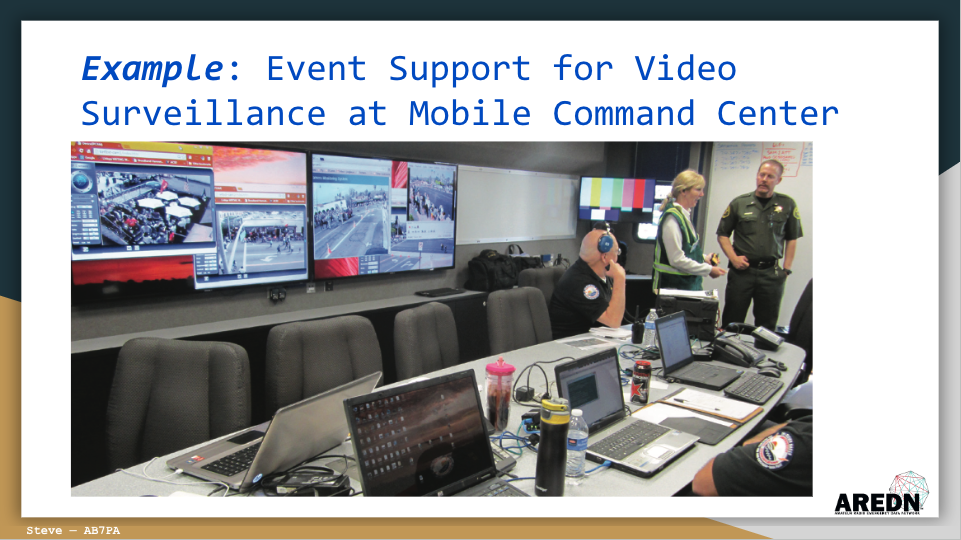

|

In this example, an amateur radio group was given the mission to provide live video feeds across a specific area. AREDN |trade| nodes with video cameras were deployed at key points along the route, and network connected computers displayed each video stream on different monitors in the Sheriff's mobile command post.

After this event someone from the served agency said, “This mesh camera system provided by RACES members was a valuable tool for our command staff. The parade was the safest in years. As we were taking the calls, we could see the activity occurring in real time. Incredibly, there was only one arrest for fighting, which just happened to take place in the camera’s view.”

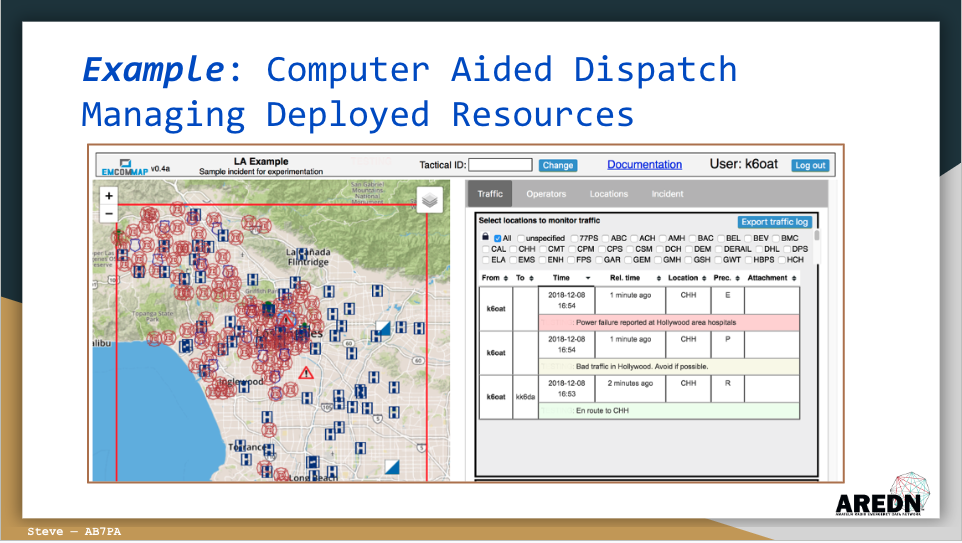

|

When a community-wide event or emergency occurs, one of the challenges is keeping track of deployed resources -- whether they are people, or places, or equipment. In this example, an AREDN |trade| network is being used to track resources and display messages that are sent between sites. The map on the left is a great visualization tool, and the main goal of this application is to increase the team’s situational awareness. The specific software running on this mesh network was developed by Dan K6OAT for the Los Angeles ARES team. People at each location are able to see what is going on around them from their mesh-connected computer.

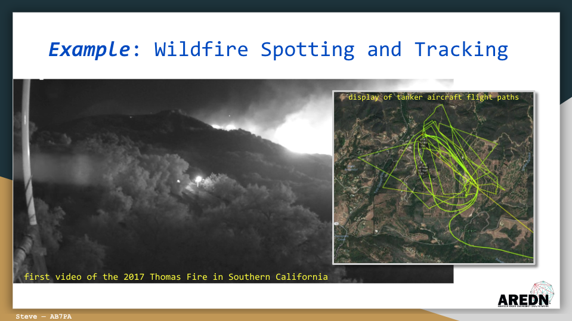

|

In southern California some of the mountaintop AREDN |trade| backbone sites were deployed with video surveillance cameras on the towers. In this example, one of these mountaintop cameras captured and recorded this image. It was the first view of the 2017 Thomas Fire. This recording was requested by the fire management authorities to be included in their after action reports.

The inset on the right is an image of the flight paths of tanker aircraft traversing the region. Flight data was captured using an ADS-B receiver and displayed from a Raspberry Pi computer on the AREDN |trade| network.

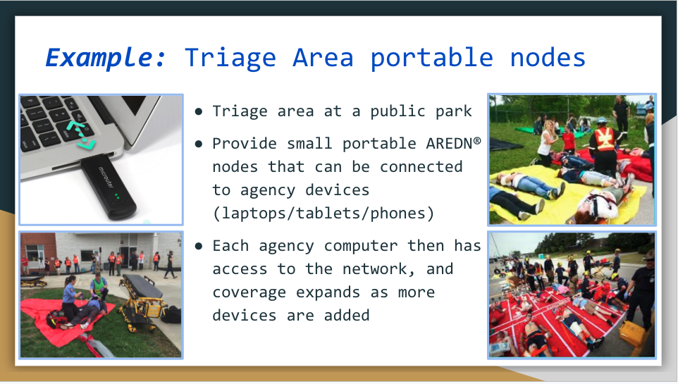

|

This example illustrates using small AREDN |trade| nodes connected to agency laptops. Each computer then has access to the AREDN |trade| network and has the ability to communicate with other network resources. This would provide local communication across a field or parking lot as shown here, but the laptops could also link to an intermediate AREDN |trade| node on top of a mast in the center of the area. From there the data could be transferred across longer distances to sites that are coordinating the event or exercise.

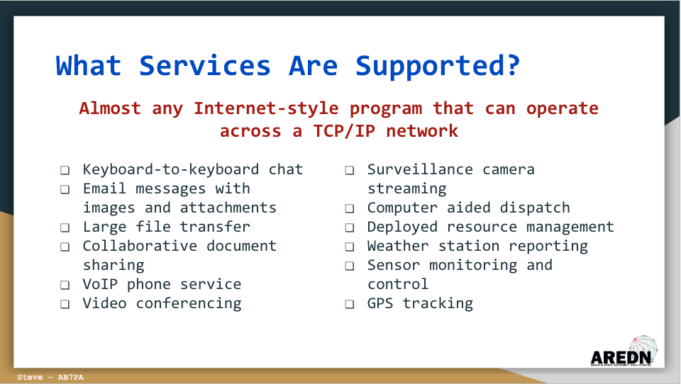

|

Almost any Internet-style program that operates across a standard TCP/IP network can be deployed using AREDN |trade| devices. This includes all of the examples shown in this list. Just remember that the services deployed should align with the specific mission or purpose for the network you are creating. Just because you can add nodes or services to a network, doesn’t mean you should add them. Each new item added to a network will use part of the limited processing and bandwidth resources that are available. Make sure your network is successful by deploying exactly what is needed in order to accomplish your mission.

Probably the best single place to go for additional information is the AREDN |trade| website at www.arednmesh.org. There you will find information about the types of radios that are supported, as well as all of the AREDN |trade| software available for download.

There is also a wealth of information on choosing devices and planning AREDN |trade| networks for EmComms. The Forum provides a way to engage with a very active worldwide community of fellow hams who are working with the same hardware and software that you are. They are eager to help answer questions, as well as testing various devices and network configurations.

Regional and local AREDN |trade| mesh groups can also be contacted through the Forum. You can also access the extensive set of documentation that is available online, including detailed sections on installing and configuring radios, planning and modeling network links, providing different kinds of services for your network, and a variety of other topics.
